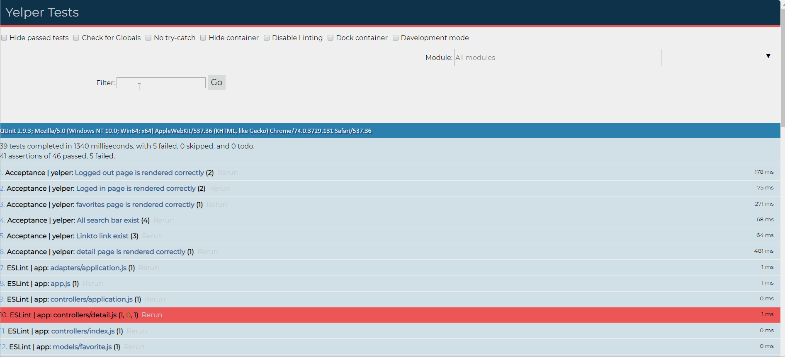

# Yelper

Author: Feng Chen

This is a application that use to search your favorite restaurants.
## Time spent
 * Tutorials, research: 2 hours
 * Coding required stories: 2 hours
 * Improvement with Login and Favorite page: 1 hours
 

### Required
 * [x] Search capability with at least three facets (e.g. name, category, location, price level, etc) 
 * [x] Search should show some form of “auto-complete” as the user is typing.
 * [x] Display detailed business information, such as:(e.g. Phone, Review Count and details, Hours)
 * [x] Add login ability via Firebase
 * [x] Add “Favorites” page, listing out all Favorites
 * [x] Provide user with ability to Save/Unsave to their Favorites

### Optional

 * [x] Show location in Google Maps
 

## GIF Walkthrough

After I added login and favorite page

Acceptance test

## Notes & shoutouts

I feel like the GraphQL make the APi much easier to deal with, and the only difficult part was how to setup Google map.
The login and favorite page should have no problems if I follow the steps. 

I have also added the acceptance test which to make sure everything rendering correctly.
